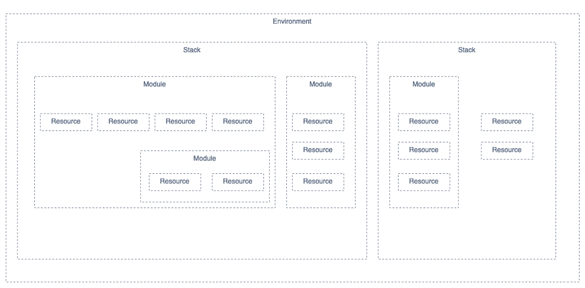
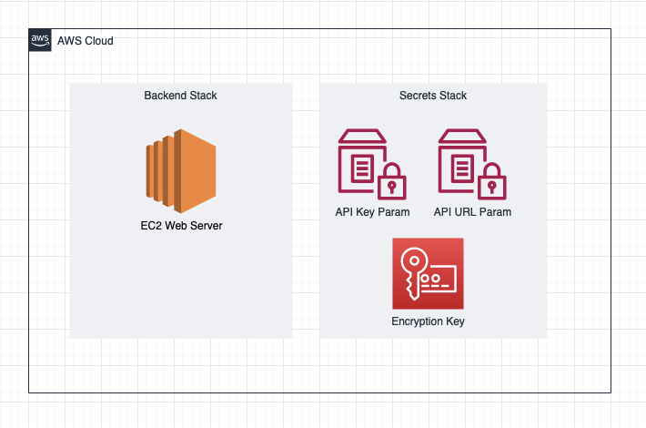

# Terragrunt Starter Project

*This repository is WIP, if you find anything unclear, please create an Issue. Pull Requests with improvements are also welcome.*

This repository contains all that is needed to set-up a new IaC project using Terragrunt. <br>
This starter project is heavily opinionated to fit most of the projects within DWS. In particular, this means that:

- The project is set-up to create 3 environments - Dev, UAT and Prod. Following the AWS Account per project, per environment convention these will be created in different AWS accounts and nothing else should run in those accounts. It is therefore *NOT* suited for deployments into the Shared AWS Accounts.
- Terraform Cloud us used as a remote module repository. Remote backend is using S3 for Statefile storage and versioning. DynamoDB is used for statefile locking. Finally, the CI/CD pipeline is using GitHub Actions and not Terraform Cloud for deployments in order to gain more customisation options within the pipeline and to keep the whole lifecycle close to development teams.
- Development team has full control and also full responsibility over all environments, following the "you build it, you run it" approach. Operations team is available for help and advice, is involved in overall compliance of the estate, but **they are not responsible for implementation and operation of the project.**

# Concepts
## Terragrunt versus plain Terraform
Terragrunt does not replace Terraform - it is a thin wrapper on top of it. It makes it far easier to manage multi-account deployments. <br>
It also allows us to easily split the environment into multiple stacks, each with a separate Statefile, and to pass explicit dependencies between those, which leads to stronger resource separation.<br>
You can learn more about Terragrunt in the [Documentation](https://terragrunt.gruntwork.io/docs/#features)

## Stacks versus Modules
A module is a container for multiple resources that are used together. 
In Aurora, we have a number of low-level non-opinionated modules which are composed into a smaller number of high-level, opinionated modules.
For example the `s3-cdn` module which creates a number of resources and calls several other modules in order to create everything needed to host SPA application, including CloudFront distro, S3 buckets, OAIs, Bucket policies, certificates, deploy users, DNS entries and so on.

Stack is one level higher. It is where you compose these high-level, but application-agnostic modules into "cognitively and factually connected super-modules" that together compose your application. <br>
For example, you could have a C# app running within a container which connects to a database and exposes an API.  <br>
You could create a `backend` stack containing the `ecs-service` module to run your application, as well as an `rds` module to create your application. Since the database is only used by this service, it makes sense to group them together. <br>
However, when it comes to networking, it is likely that the same VPC will be used by more services in the future. It is not owned wholly by the `backend` service -> it should therefore be created within a different stack - `network` - and passed to the `backend` stack as a dependency. <br>
It both separates it logically, and also factually - since it is created in different stack it will be stored in a different Statefile from the `backend` stack. A rogue change on the `backend` stack now has no way to break the `network` stack and thus negatively impact other services. <br>
In the scenario above, you will also likely have an `account` stack containing AWS account-wide resources (like Cloudtrail or encryption keys) and maybe a `frontend` stack to create your frontend application resources. <br>
Stacks are defined in the `/stacks` folder.

## Composing Stacks into Environments
An Environment is a complete set of all resources deployed within one AWS account. Stacks are environment-agnostic and are composed into Environments. <br>
Environment is where you have to explicitly define dependencies passed between the individual stacks and where you pass configuration variables for your Environment. <br>
You should strive to keep Dev, UAT and Live Environment definitions same to ensure that your pre-live environments are as close to live as possible. <br>
There are, however, use cases where you might intentionally want to deploy a different set of resources into Live than into other environments. Environments are ideal for this -> you can emit, add or substitute Stacks that are initiated within a particular Environment as you want. <br>
Environments are defined in `/terraform/environment_name` folder.




### Dependency management
You are likely going to need to pass values between Stacks. For example, you might create VPC within the `network` stack and an ECS service within the `backend` stack. 
The ECS service needs to accept a list of Subnet IDs that it should deploy containers into, but it does not have access to the VPC module directly since the `network` stack is backed by a different Statefile.
To pass this information you need to:
1. Add `subnet_id_list` output to the `network` Stack
2. Add `subnet_id_list` variable to the `backend` Stack
3. Add `dependency` block into `/terraform/environment_name/backend/terragrunt.hcl` file. This block will look like:

```
dependency "network" {
  config_path = "../network"

  mock_outputs = {
    subnet_id_list     = ["subnet-abc12345", "subnet-abc54321", "subnet-cde12354"]
  }
}
```
Note the `mock_outputs` block - these are going to be used during Plan when the real outputs are not yet available - for example during the first creation of the `network` stack.
These are not required, but they will make your Plans much easier to read since the Plan for your `backend` stack will show these values rather than the blanket `computed` keyword.
In some cases, Plans might also fail when `mock_outputs` are not defined.
The `mock_outputs` are only used during Plan stage, they are substituted for real values during Apply stage.

4. Amend the `inputs` block in `/terraform/environment_name/backend/terragrunt.hcl` file. This will look like:
```
inputs = {
  subnet_id_list = dependency.network.outputs.subnet_id_list
}
```

## Configuration pipeline
You are likely to need to pass configuration variables into your project. You will, broadly, have 3 levels of configuration properties in addition to Secrets.

### Global Properties
- Same for all Environments, for example Project code, AWS Region or VPC CIDRs
- Defined in `terraform/global.yaml` file, terragrunt then passes the values into all Stacks within all Environments, as long as the variable name in Stack's `variables.tf` file exactly matches keys in the yaml file.

### Environment properties
- Specific on per-Environment basis, for example AWS Account ID, auto-scaling configuration or 3rd-party service URLs
- Defined in `/terraform/environment_name/env.yaml` file
- Overrides Global properties with same key

### Stack properties
- Not commonly used, but it is possible to specify stack-level properties
- Defined in `inputs` block in `/terraform/environment_name/stack_name/terragrunt.hcl` file.
- Overrides both Global and Environment properties

### Secrets
- Used for all Secret values that should **NOT** be committed into Git in plaintext
- Uses [SOPS](https://github.com/mozilla/sops) with remote KMS key for encryption. This way the values can be safely stored in a Git repository.
- Encrypted values stored in `/terraform/environment_name/secrets.yaml`
- To write into the secrets file, your IAM user needs access to the remote KMS key that this file is encrypted with. If you have access, cd into `/terraform` and then call `sops environment_name/secrets.yaml` to decrypt the file in your terminal. Once you are done editing, simply exit the editor and the file will get re-encrypted.
- The secrets file is decrypted during CI/CD run and values are injected into Environment properties. Where a same key is defined in Secrets and Environment properties, the Secrets value takes precedence.
  
## Version Control
All infrastructure code should be stored in Git. This allows you to apply the same good development practices - like code reviews - to the infra code just as you would to the application code.
This starter project is heavily opinionated and is set-up to create 3 Environments from 3 different git branches.
Dev Environment is created from the `dev` branch, UAT Environment is created from `uat` branch and Live Environment is created from `main` branch. If you need different environment structure, you will need to edit the GitHub Actions workflow file in `/.github/plan_apply.yaml` to add support for those.

When working on a new change, you should branch out from `dev` branch and implement your changes on your new branch.
When the change is done, you should open a PR from your branch back into `dev`. This will trigger automated checks in Github Actions pipeline.

### Pull Request checks
- [Tfsec](https://github.com/aquasecurity/tfsec) performs static analysis using default rules. This can highlight changes that would introduce security issues into the environment. At the moment, tfsec only prints its results and does not fail the pipeline.
- Terragrunt performs a Plan. Remote Statefiles are *locked* whilst this action runs and will get *unlocked* when the action finishes.
- [Danger](https://danger.systems/ruby/) analyses the Plan for errors and violations of rules defined in `/Dangerfile`
- Plan and Danger outputs are placed into a Comment on the PR. **You need to always manually review the Plan to ensure that you are happy with the proposed changes**
- When you are happy with the Plan, you can merge the PR into the `dev` branch.

### Deploy action
- Is triggered on merge or commit to `dev`, `uat` and `main` branch. Although you can trigger this flow by pushing to one of these branches directly, you should always prefer Pull Requests which give you ability to review the Plan without Applying it.
- [Tfsec](https://github.com/aquasecurity/tfsec) performs static analysis using default rules.
- Terragrunt creates a new Plan. Remote statefiles are *locked* whilst this action runs.
- Terragrunt Applies the previously created Plan. Remote statefiles are *locked* whilst this action runs and are *unlocked* when it finishes.

#### Troubleshooting State Lock
In rare circumstances the pipeline may not unlock the remote state file. This is most likely to happen if you cancel the pipeline run before it finishes, but can also occur as a result of transient error in network and/or AWS. <br>
If this happens, all subsequent pipeline runs will fail. To resolve this issue, you will need to manually unlock the state. <br>

1. Log into target AWS account with a privileged role and navigate to DynamoDB Console
2. List items in the state locking table. It will be named "application_name-terraform-state-locking"
3. Manually delete the Lock record, it will be the only record with LockID key. 

### CI/CD Authentication
The GitHub Actions pipeline needs to authenticate and authorise actions in several external systems. Details to facilitate these connections are stored in the [Repository Secrets](https://docs.github.com/en/actions/security-guides/encrypted-secrets)

#### AWS
GitHub is an [OIDC Provider](https://docs.github.com/en/actions/deployment/security-hardening-your-deployments/about-security-hardening-with-openid-connect) which removes need for an IAM Deploy user with long-term credentials.
Instead, the GitHub Actions workflow assumes a role in AWS for each run. Trust policy on the Deploy role means that the Deploy role can only be assumed by a specific branch within a specific repository. This is much more secure than long-term credentials.
You can learn more about concepts behind this from [GitHub](https://docs.github.com/en/actions/deployment/security-hardening-your-deployments/configuring-openid-connect-in-amazon-web-services) and [AWS](https://docs.aws.amazon.com/IAM/latest/UserGuide/id_roles_providers_create_oidc.html) documentation.
The Deploy role ARN needs to be stored in `DEV_DEPLOY_ROLE_ARN`, `UAT_DEPLOY_ROLE_ARN` and `LIVE_DEPLOY_ROLE_ARN` secrets.
The Deploy role can only be assumed by specific branches, and so it does not work with Pull Requests. To support automated Pull Request checks, a Plan role is used. This role does not have any Write permission and can be assumed by any Pull Request within the specified repository.
The Plan role ARN needs to be stored in `DEV_PLAN_ROLE_ARN`, `UAT_PLAN_ROLE_ARN` and `LIVE_PLAN_ROLE_ARN` secrets.

#### Terraform Cloud
Vast majority of modules you are likely to use are going to be in-house developed and stored on Aurora's Terraform Cloud private module repository.
The authentication token is stored in `TF_API_TOKEN` secret and can be populated by the Ops team.

#### Danger Systems
[Danger](https://danger.systems/ruby/) needs access to the repository the pipeline runs so that it can add comments to the PR.
The token is stored in `DANGER_GITHUB_TOKEN` secret, follow steps in [Documentation](https://danger.systems/guides/getting_started.html) on how to generate it.


## Sample project

This repository contains all the skeleton required to create a Terragrunt-managed environment on new set of AWS accounts. <br>
Additionally, it contains 2 Stacks to showcase how Stacks are composed into Environments and how dependencies are passed between Stacks. <br>
First Stack is `Secrets`, which creates a KMS Encryption Key and 2 Systems Manager - Parameter Store parameters containing secret configuration properties. 
This is the de-facto standard way of handling secret values for Aurora projects, and you are likely to keep this stack and expand on it in your own project. <br>
The second Stack is `Backend` which deploys a single EC2 instance into the default VPC and injects the configuration properties from the `Secrets` Stack into the User Data of the EC2 instance. You are likely to delete this stack in your own project.



# Initial set-up
There is a number of one-off setup steps required before you can use this starter template for your project.

### Pre-requisites
1. Speak to Ops team to provision AWS accounts for your project and configure your SSO user with access to the account. You will need to use the DeveloperAdmin role to perform the initial setup. Refer to [SSO Docs](https://unionstreet.atlassian.net/wiki/spaces/AFI/pages/3607232523/AWS+Single+Sign+On) for guidance on setting up your environment.
2. Install [AWS CLI](https://aws.amazon.com/cli/) on your machine and configure it with the shared credentials. It is recommended to use [AWS Vault](https://github.com/99designs/aws-vault) to keep your credentials secure.
3. Install [Terraform](https://learn.hashicorp.com/tutorials/terraform/install-cli)
4. Install [SOPS](https://github.com/mozilla/sops)

### First-time project set-up
1. Clone this repository and change the repository URL to point to your project's GitHub repository
`git remote set-url origin git@github.com:USERNAME/REPOSITORY.git`
2. Remove the `backend` and `secrets` stacks (unless you want to keep the `secrets` Stack) from `/stacks` and from `/terraform/dev/`
3. Run the `init` module against your AWS accounts in order to create resources used by Terraform. Refer to the init module [README](/init/README.md)
4. Configure GitHub Actions secrets specified in [CI/CD Authentication](#ci/cd-authentication)
   1. Values for `ENV_DEPLOY_ROLE_ARN` is going to be `arn:aws:iam::0123456789012:role/TerraformDeployRole` where `0123456789012` stands for the respective AWS Account IDs
   2. Values for `ENV_PLAN_ROLE_ARN` is going to be `arn:aws:iam::0123456789012:role/TerraformPlanRole` where `0123456789012` stands for the respective AWS Account IDs
   3. Value for `TF_API_TOKEN` will be filled by the Ops team
   4. Follow [Getting Started](https://danger.systems/guides/getting_started.html) to obtain token to put into `DANGER_GITHUB_TOKEN`
   
5. Configure SOPS
   1. Delete existing secrets file in `/terraform/dev/secrets.yaml`: <br>
      `rm /terraform/dev/secrets.yaml`
   2. Edit `/terraform/.sops.yaml` and pass in the KMS Key ID created by the Init module. You can obtain the ARN from the AWS Console -> Customer-Managed Keys -> `terragrunt-starter-sops-encryption-key`. Keep in mind that the Key ARN will be different for each one of your AWS accounts.
   3. Create the encrypted secrets files
      1. `cd /terraform`
      2. `aws-vault exec devaccount  -- sops dev/secrets.yaml`
      3. `aws-vault exec uataccount  -- sops uat/secrets.yaml`
      4. `aws-vault exec liveaccount -- sops live/secrets.yaml`

6. Configure Global variables in `/terraform/global.yaml`
7. Update the `aws_account_id` variable in `/terraform/dev/env.yaml`, `/terraform/uat/env.yaml` and `/terraform/live/env.yaml`
   1. Delete `api_url` and `ami` variables from `/terraform/dev/env.yaml`

# Next Steps
Your project should now be ready. Branch out from `dev` and add a Stack creating a simple resource - like an EC2 or an S3 bucket. 
Then create a PR back to `dev` and check that your pipeline works. When you are happy, merge your changes to `dev` and check that the resource is created in the Dev AWS account.
Continue with merging the changes to `uat` and to `live` to validate that your entire pipeline works.

If all is green, you can go build something amazing! If you need help, join the `team-aws` channel on Slack or message a member of the Ops team.
We will also be very grateful if you share any feedback you have about this starter project, either with the Ops team, or by creating Issues/PRs in this repository respectively.